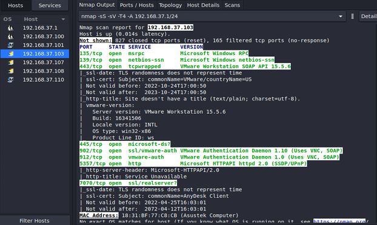

# Network Traffic Analysis Lab

## Introduction
Network traffic scanning tools such as tcpdump and Wireshark. The objective is to understand their functionalities, installation, and usage for capturing and analyzing network traffic.

## Objectives

Understand the purpose and capabilities of tcpdump and Wireshark.

Install these tools on a physical or virtual machine.

Capture network traffic based on a given scenario and save the traffic dump.

Utilize Wireshark filters for traffic analysis.

Document the results in a report.

## Task Description

1. Tcpdump - A powerful command-line packet sniffer for capturing and inspecting network traffic.

2. Wireshark - A GUI-based network protocol analyzer with a command-line variant, offering graphical insights into captured data.

3. Scenario: Making a voice call using Skype.

4. Steps:

* Install tcpdump and Wireshark.

* Determine the IP address of the machine. 
    
* Initiate an audio call via Skype.  
* Capture traffic using tcpdump. 
  
* Analyze the captured data in Wireshark. 
* Identify key communication protocols (DNS, TCP, TLS, UDP). 

## Key Observations

* DNS Requests: Skype queries domain names before establishing a connection.  
  
* TCP Handshake: The three-way handshake process initializes the communication.  
  
* TLS Encryption: Most data transfer occurs over TLSv1.2 for security.  

* UDP Usage: The Skype call transmits audio/video data over UDP ports.  
  
* Comparison: The analysis results from tcpdump and Wireshark were similar.  
  
## Conclusion
The lab provided hands-on experience in capturing and analyzing network traffic using tcpdump and Wireshark. The study helped understand how network packets are transmitted and secured in real-time applications like Skype.
